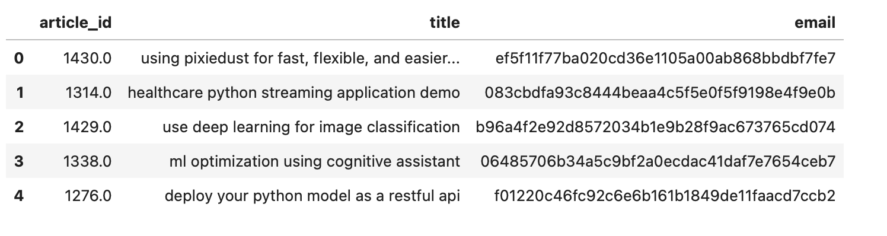
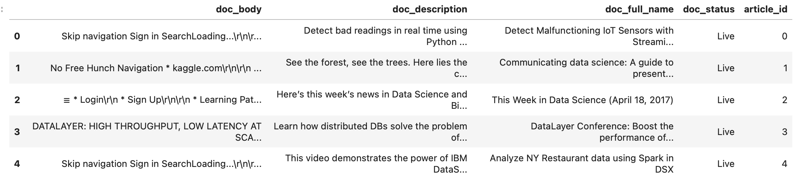

# IBM Recommendation Engine Project
### Project Description and motivation
In the IBM Watson Studio, there is a large collaborative community ecosystem of articles, datasets, notebooks, and other A.I. and ML. assets. Users of the system interact with all of this. For this project we analyzed the interactions that users have with articles on the IBM Watson Studio platform, and make recommendations to them about new articles you think they will like. This personalizes the experience for each user

### Project Data:

In the data folder, we have the following files:

- user-item-interactions.csv: This file contains the articles each user has interacted with.

- articles_community.csv: This file contains more information about each article. This project file was not used in the project but there are some extra challenges stated in the project notebook that we can use this file for.

### project Implementation
In this project, we covered in details the following aspects of recommendation engine;

- **Rank Based Recommendations**: In this section we created ranks for each article based on how frequent they have been read. We used this  recommendation to solve the cold start problem.
- **User based Collaborative Filtering**: This section was the meat of the whole project and most challenging for me. Here, we created ranks for users based on their similarities with other users and the number of article they have read. Similarities with other user is             measured using the articles common to users. e,g if user B has read 5 same articles as user A while user C has read 3 same articles as       user A. User B is more similar to user A than user C
- **Matrix Factorization**: We used this to try to test the accuracy of our recommendation engine to see if it is ready for deployment. We   will still need to do further test on real data before we can deploy our recommendation engine

The jupyter notebook for all analysis is included in the project files. Just run through each cell for a better unnderstanding of what was done in this project. Have a fun time learning!